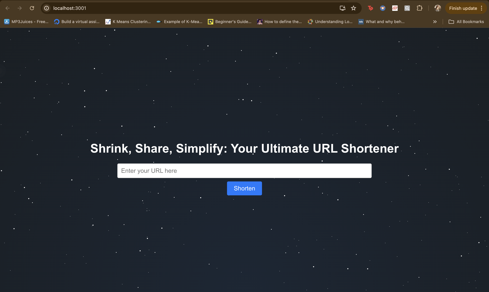
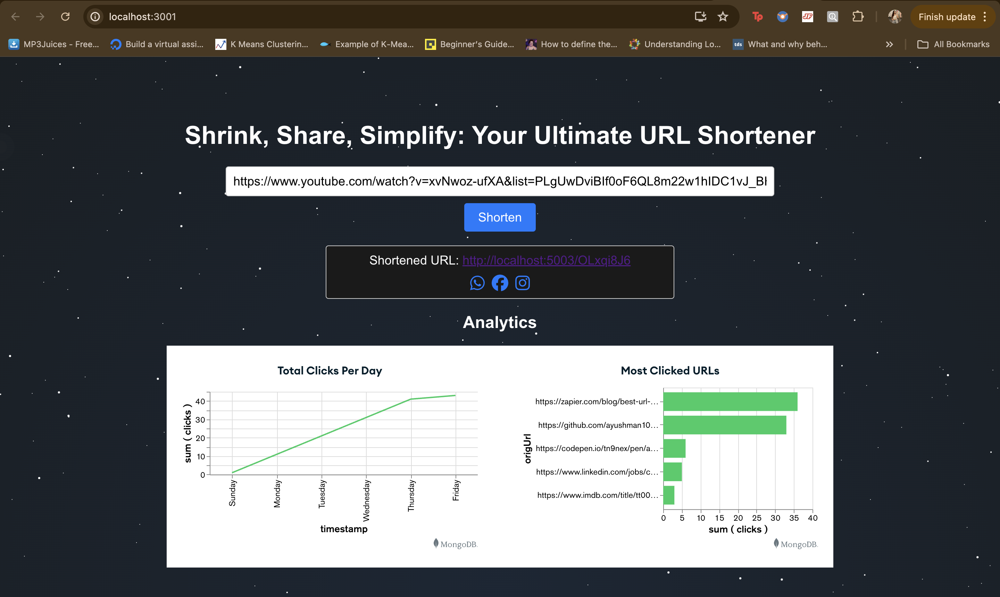

# Shrink, Share, Simplify: Your Ultimate URL Shortener

## Overview

The URL Shortener App is a full-stack web application that allows users to shorten long URLs, track click analytics, and share the shortened URLs via WhatsApp and Facebook. It is built using the MERN stack (MongoDB, Express.js, React.js, Node.js).

## Features

- Shorten long URLs
- Track click analytics including timestamps, user agents, country, and city
- Visualize analytics data with MongoDB Charts
- Share shortened URLs via WhatsApp and Facebook

## Screenshots
### Home Page

### Shortened URL, Analytics and Sharing Options

## Video Demonstration
Watch the video below to see the URL Shortener App in action:
[Watch the Demo Video](https://drive.google.com/file/d/1ICvRMLIPkOEjW0BhFemy8BLi_jUnVAYg/view?usp=sharing)

## Technologies Used

- **Frontend**: React.js, Axios, CSS, FontAwesome
- **Backend**: Node.js, Express.js, MongoDB, Mongoose
- **Database**: MongoDB
- **Analytics**: MongoDB Charts
- **Other Tools**: Docker (for containerization), GitHub (for version control)

## Setup

### Prerequisites

- Node.js and npm installed
- MongoDB Atlas account (or local MongoDB instance)
- Docker (optional, for containerization)

### Installation

1. **Clone the repository**

- git clone https://github.com/ananya128/url-shortener-app.git
- cd url-shortener-app

2. **Backend Setup**
   
- Navigate to the redirection-service directory and install dependencies.
  cd redirection-service
  npm install

- Create a .env file in the redirection-service directory and add your MongoDB URI and IPStack API key.
  PORT=5003
  MONGO_URI=your-mongodb-uri
  IPSTACK_API_KEY=your-ipstack-api-key
  BASE=http://localhost:5003

- Start the backend server.
  npm start

3. **Frontend Setup**
   
- Navigate to the frontend directory and install dependencies.
  cd ../frontend
  npm install

- Start the frontend server.
  npm start

- Run with Docker (Optional)
  If you prefer to run the application using Docker, you can use the provided Docker configuration.

- In the root directory of the project
  docker-compose up --build
  
## Usage
- Open your web browser and navigate to http://localhost:3000.
- Enter a long URL into the input field and click the "Shorten" button.
- The shortened URL will be displayed, and you can click on it to be redirected to the original URL.
- Click analytics and charts will be displayed below the shortened URL.

## License
This project is licensed under the MIT License. See the LICENSE file for details.

## Acknowledgements
- FontAwesome for icons
- Axios for making HTTP requests
- MongoDB Charts for data visualization

This `README.md` file should provide a clear and comprehensive guide to setting up, running, and using your URL Shortener App.
